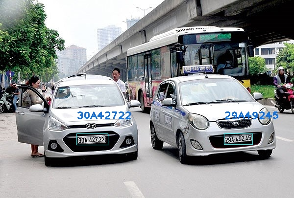

# license-plate-ssd300

Bài toán nhận diện biển số xe sử dụng mạng mobilenet-ssd300

Download data : https://drive.google.com/file/d/1GeSR1g7fwfjpNDlQ5RN0RAX5Y3qfYCj2/view?usp=sharing

Data train model tách biển số  : data/open_images. Với nhãn dạng xml : data/annotation

Data train model tách kí tự : data/open_images2. Với nhãn dạng xml : data/annotation_pl

Data train model nhận diện kí tự : data/data-kt

### Sử dụng: 

### Huấn luyện :
        Tải dữ liệu trên hoặc tự tạo dữ liệu với ứng dụng labelImg vào folder data
        // Chú ý : cần tạo file csv như định dạng trong open_images hoặc open_images2
### Model tách biển số : 
        python3 train_ssd.py --dataset_type open_images --datasets ~/data/open_images --net mb1-ssd --pretrained_ssd models/mobilenet-v1-ssd-mp-0_675.pth --scheduler cosine --lr 0.01 --t_max 100 --validation_epochs 5 --num_epochs 100 --base_net_lr 0.001  --batch_size 5 
### Model tách kí tự : 
        python3 train_ssd.py --dataset_type open_images --datasets ~/data/open_images2 --net mb1-ssd --pretrained_ssd models/mobilenet-v1-ssd-mp-0_675.pth --scheduler cosine --lr 0.01 --t_max 100 --validation_epochs 5 --num_epochs 100 --base_net_lr 0.001  --batch_size 5
### Model nhận diện kí tự :
        python3 train_kt.py
### Thử nghiệm : 
        python3 test.py